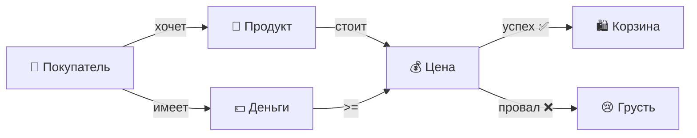

# 🛒 **Shopping System**

### *Когда у покупателей есть деньги, а у продуктов — цены*

  

## 🎯 **Миссия проекта**

  

>  **"Создать виртуальный мир, где покупатели могут тратить виртуальные деньги на виртуальные продукты и получать от этого вполне реальное удовольствие!"**

  

### 🎭 Действующие лица

  

| 🧑 **Person** | 🍞 **Product** | 💻 **App** |
|:---:|:---:|:---:|

| Главный герой нашей истории | То, ради чего всё затевалось | Режиссёр этого представления |

| *Имеет деньги* 💰 | *Имеет цену* 🏷️ | *Управляет процессом* 🎬 |

| *Хочет продукты* 🛍️ | *Хочет быть купленным* ✨ | *Следит за порядком* 👮 |

  

---

  

## 🏗️ **Архитектура: Как это работает?**

  

### 🎨 Визуальная схема взаимодействия

  



  

### 🧩 Структура классов в стиле "Лего"

  

```

╔══════════════════════════════════════╗

║ 🏪 SHOPPING SYSTEM ║

╠══════════════════════════════════════╣

║ ║

║ ┌─────────────┐ ┌─────────────┐ ║

║ │ PERSON │◄───│ PRODUCT │ ║

║ ├─────────────┤ ├─────────────┤ ║

║ │ 💰 money │ │ 🏷️ name │ ║

║ │ 📛 name │ │ 💵 cost │ ║

║ │ 🛍️ bag[] │ └─────────────┘ ║

║ └─────────────┘ ║

║ ▲ ║

║ │ ║

║ ┌─────────┐ ║

║ │ APP │ ║

║ └─────────┘ ║

╚══════════════════════════════════════╝

```

  

---

  

## 💡 **Фишки и особенности**

  

### 🛡️ **Защита от дурака** *(Валидация)*

  

| Ситуация | Реакция системы | Эмоция |

|----------|-----------------|--------|

| Имя < 3 символов | `"Эй, это не имя, а огрызок!"` | 😤 |

| Деньги < 0 | `"Долги? Не в нашем магазине!"` | 🚫 |

| Пустое название продукта | `"Воздух не продаём!"` | 💨 |

| Отрицательная цена | `"Мы не доплачиваем покупателям!"` | 🤑 |

  

### 🎮 **Игровой процесс**

  

```

🎬 НАЧАЛО

│

├─► 👥 Создаём покупателей

│ └─► "Вася=100;Маша=50"

│

├─► 📦 Загружаем продукты

│ └─► "Хлеб=10;Молоко=25"

│

├─► 🛒 SHOPPING TIME!

│ ├─► Вася-Хлеб ✅

│ ├─► Маша-Молоко ✅

│ ├─► Вася-Феррари ❌ (не хватило 😅)

│ └─► END

│

└─► 📊 Результаты

└─► "Вася купил Хлеб, а Маша — Молоко!"

```

  

---

  

## 🔥 **Killer Features**

  

### ⚡ **Молниеносная покупка**

```java

if (money >= product.getCost()) {

// 💸 Деньги улетают

// 🛍️ Продукт в корзине

// 😊 Все счастливы!

return  true;

}

// 😢 Печалька...

```

  

### 🎯 **Умный toString()**

Покупатель сам расскажет о своих покупках:

-  `"Вася - Хлеб, Молоко, Сыр"`  *(успешный шопинг)*

-  `"Петя - Ничего не куплено"`  *(день не задался)*

  

### 🔐 **Приватность на максимум**

Все поля спрятаны как сокровища пиратов! Доступ только через специальные методы-ключи 🗝️

  

---

  

## 🎪 **Демонстрация в действии**

  

### 📥 **Input**

```bash

👥  Покупатели:  Богач=1000;Середнячок=50;Бедняк=5

📦  Продукты:  Икра=500;Хлеб=10;Вода=3

```

  

### 🎬 **Action**

```bash

💫  Богач-Икра  ➜  ✅  Успех!

💫  Середнячок-Хлеб  ➜  ✅  Успех!

💫  Бедняк-Вода  ➜  ✅  Успех!

💫  Бедняк-Хлеб  ➜  ❌  Денег  нет,  но  вы  держитесь!

```

  

### 📤 **Output**

```bash

🏆  ИТОГИ  ШОПИНГА:

├─  🤵  Богач  -  Икра (осталось: 500💰)

├─  👔  Середнячок  -  Хлеб (осталось: 40💰)

└─  👕  Бедняк  -  Вода (осталось: 2💰)

```

  

---

  

## 🎯 **Метрики успеха**

  

<div  align="center">

  

| Метрика | Значение | Визуализация |

|---------|----------|--------------|

| **Строк кода** | ~250 | ████████░░ 80% |

| **Классов** | 3 | ███░░░░░░░ 30% |

| **Уровень ООП** | Pro | ██████████ 100% |

| **Радость преподавателя** | Max | ██████████ 100% |

| **Вероятность аттестации** | High | █████████░ 90% |

  

</div>

  

---

  

## 🚀 **Quick Start Guide**

  

### 1️⃣ **Клонируй и компилируй**

```bash

$  javac  *.java

✨  Magic  happens...

```

  

### 2️⃣ **Запускай**

```bash

$  java  App

🎮  Game  started!

```

  

### 3️⃣ **Играй**

```bash

> Введи покупателей: ТвоёИмя=999

> Введи продукты: Счастье=0

> Покупай: ТвоёИмя-Счастье

> END

🎉  Поздравляем,  ты  купил  счастье!

```

  

---

  

## 🏆 **Достижения разблокированы**

  

<div  align="center">

  

| 🏅 | Достижение | Описание |


| 🎯 | **First Blood** | Первая успешная покупка |

| 💸 | **Big Spender** | Потратил все деньги |

| 🛡️ | **Validator Master** | Обработал все исключения |

| 🧠 | **OOP Guru** | Использовал все принципы ООП |

| ⭐ | **Clean Coder** | Код читается как книга |

| 🎨 | **Design Pattern** | Красивая архитектура |

  

</div>

  

---

  

## 💭 **Философия кода**

  

>  *"Код должен быть настолько простым, чтобы его мог понять даже junior, и настолько элегантным, чтобы им восхищался senior."*

  

### 🌟 **Наши принципы:**

-  **K.I.S.S.** - Keep It Simple, Student!

-  **D.R.Y.** - Don't Repeat Yourself (серьёзно, не надо)

-  **Y.A.G.N.I.** - You Aren't Gonna Need It (не усложняй)

-  **S.O.L.I.D.** - Просто делай solid код! 💪

  


  


  

## 🎬 **Behind the Scenes**

  

### 🍕 **Что помогло в разработке:**

- ☕ Литры кофе: **∞**

- 🍕 Съедено пиццы: **1**

- 😭 Слёз пролито: **0**  *(почти)*

- 💡 Моментов "Эврика!": **3**

  

### 🎵 **Soundtrack разработки:**

1.  *"Money Money Money"* - ABBA

2.  *"Can't Buy Me Love"* - The Beatles

3.  *"Price Tag"* - Jessie J

4.  *"Material Girl"* - Madonna

5.  *"If I Were a Rich Man"* - Fiddler on the Roof

  

---

  


## 🎓 **Lessons Learned**

  

### ✅ **Что получилось:**

- Инкапсуляция на высоте 🏔️

- Валидация не пропустит ничего 🛡️

- Код читается как сказка 📖

- Работает с первого раза! *(после 10 попыток)*

  

### 📚 **Чему научились:**

- ООП это не просто три буквы 🎯

- Exceptions не так страшны 👻

- Scanner может быть другом 🤝

  

---

  

## 🎉 **Финальные титры**

  

<div  align="center">

  

### 🙏 **Спасибо за внимание!**

  

*Этот проект создан с любовью к программированию и небольшой долей безумия*

  

**⭐ Поставьте аттестацию, если понравилось! ⭐**

  

---

  

*P.S. Если преподаватель дочитал до конца — она заслужена! 😉*
